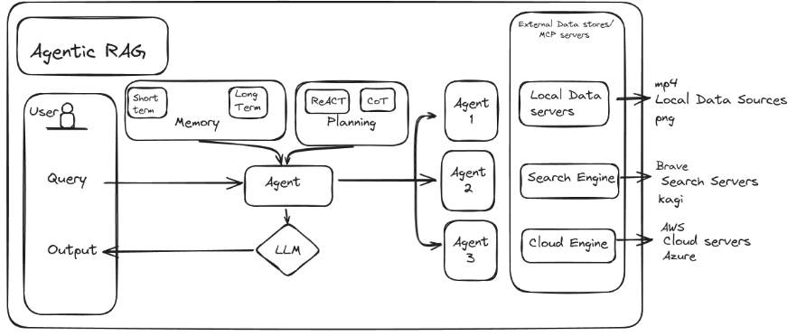

# Agentic RAG – Invoice → PO Matcher (Minimal Demo)

A small, runnable Agentic RAG pipeline that explains why an invoice was flagged, shows the evidence (PO, goods receipt, invoice lines), returns a match score, verifier confidence, and logs planner/agent actions.

## Quickstart

1. Create and activate a virtual environment
   - Windows PowerShell:
     ```powershell
     python -m venv .venv
     .venv\\Scripts\\Activate.ps1
     ```
2. Install dependencies
   ```powershell
   pip install -r requirements.txt
   ```
3. Set your environment variable for OpenAI
   ```powershell
   $Env:OPENAI_API_KEY = "YOUR_KEY"
   # Optional: choose a model
   $Env:OPENAI_MODEL = "gpt-4o-mini"
   ```
4. Run the demo
   ```powershell
   python -m src.main --query "Why was invoice INV-123 flagged?"
   ```
5. Try a follow-up
   ```powershell
   python -m src.main --query "Approve it"
   ```

- **Outputs**: console + JSONL audit at `logs/audit-<timestamp>.jsonl`.
- **No key?** The system falls back to a templated explanation.

## Architecture (Minimal)



- **Planner**: Regex to detect invoice ID and choose steps.
- **Retriever**: Loads CSV lines for invoice, PO, receipts; records row indices as source offsets.
- **Verifier**: Heuristics for price variance, total variance, and receipt shortfall → returns a match score and reasons.
- **Synthesizer**: Uses OpenAI (if key present) to produce a grounded summary that includes sources; otherwise uses a fallback template.
- **Audit**: Every step logs to JSONL.
- **Follow-up**: "Approve it" will return a mock response requiring human confirmation.

## Known Limitations

- Not production-grade; heuristics only and no embeddings.
- Simple CSV loader; no DB/warehouse connectivity.
- Web results are not deeply fused; they are shown as context.
- Short-term memory is in-process and ephemeral.
- Always requires human confirmation for actions (approve, pay, etc.).

## Demo Checklist

- Architecture diagram, 2–3 demo queries, retrieved evidence, and audit log snippet for the submission doc.